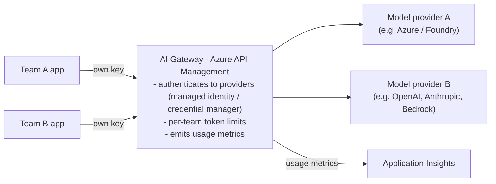
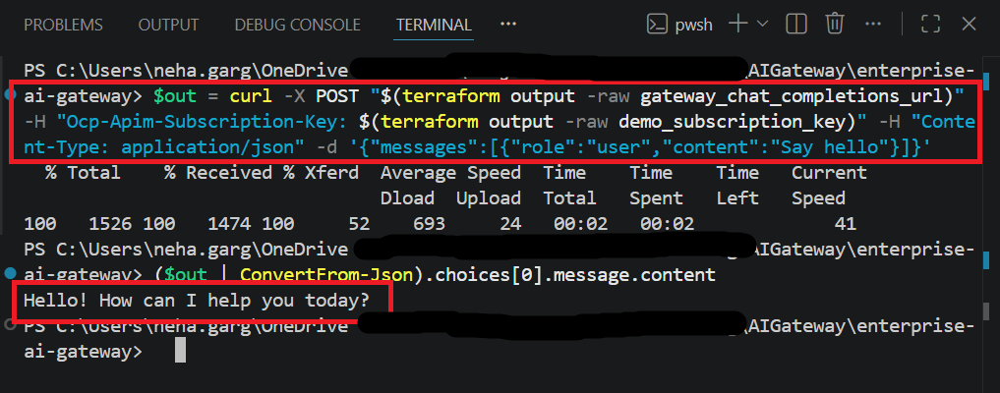
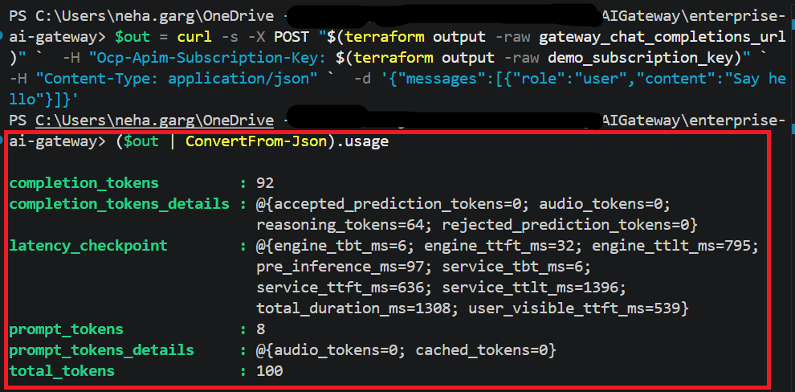
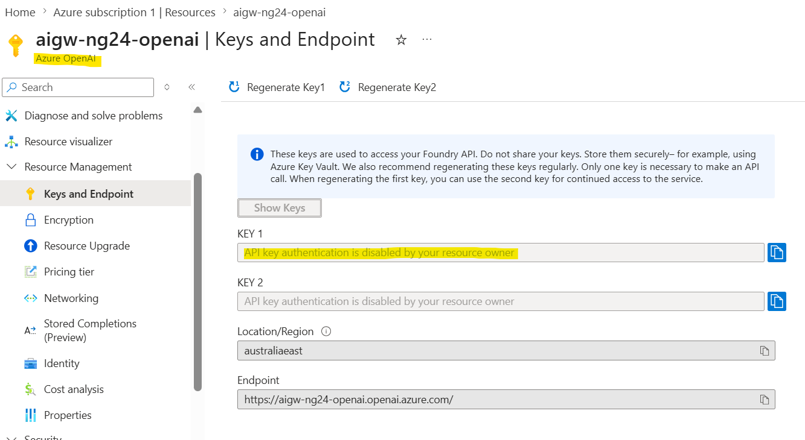

# Enterprise AI Gateway

An enterprise gateway for large language models — built as infrastructure-as-code on Azure API Management, with cost control, per-team governance, and usage visibility. The model backend is **pluggable across providers** (Azure / Foundry, OpenAI, Anthropic, Amazon Bedrock, or self-hosted) — any endpoint exposing an OpenAI-compatible or Anthropic-schema API.

> Built by an integration architect to explore the GenAI gateway pattern from an enterprise integration and governance angle. It's a proof of concept, not a production system (see [Production considerations](#production-considerations)). It builds on Azure API Management's documented [AI gateway capabilities](https://learn.microsoft.com/en-us/azure/api-management/genai-gateway-capabilities) — so the value here is in the design decisions (which capabilities matter, the tradeoffs behind each, and a coherent reference you can reason about end to end) rather than the infrastructure code itself.

---

## The problem

When an organisation adopts large language models, the quickest path is to let every application call the model endpoint directly. It works on day one and breaks by month three:

- **Uncontrolled spend.** Tokens cost money, and nothing caps how many any one app consumes.
- **No cost attribution.** Finance sees a single bill, with no way to charge it back to the team or product that ran it up.
- **One shared key, full access.** A single API key passed around means no isolation between consumers and no clean way to revoke just one of them.
- **No consistency or self-service.** Every team integrates with the raw provider on its own — re-implementing auth, retries, and rate handling — with no central, governed way to onboard.
- **No resilience.** When a provider or region throttles or hits its quota, calls simply fail, with nothing to fail over to.

None of these are AI problems. They're integration and governance problems — the same ones enterprises solved for APIs years ago, now reappearing in front of models.

## The solution

Put a gateway between the consumers and the models. This project uses **Azure API Management** (an Azure-native gateway) as that gateway, and treats the model backend as pluggable — fronting any provider that exposes an OpenAI-compatible or Anthropic-schema endpoint (Azure / Foundry, OpenAI, Anthropic, Amazon Bedrock, self-hosted).

Each consuming team calls the gateway with its own credential. The gateway authenticates outward to the model provider (a managed identity for Azure-hosted models, credential manager for others — so consumers never hold the provider's own key), enforces per-team token limits, and emits usage metrics so cost can be attributed back to the team that incurred it. With more than one backend, it can also route and fail over for resilience.

## What it demonstrates

| Capability | How |
|---|---|
| Pluggable model backend | API Management fronts any OpenAI-compatible or Anthropic-schema model endpoint |
| No shared secrets | Gateway authenticates outward via managed identity / credential manager; consumers never hold the provider key |
| Per-team access & cost attribution | Each team gets its own API Management subscription key; usage is metered per consumer |
| Spend control | The `llm-token-limit` policy caps tokens per consumer |
| Usage visibility | The `llm-emit-token-metric` policy sends per-team token metrics to Application Insights |
| Resilience *(stretch)* | Backend load balancing and circuit breaker across multiple providers |

## Tech stack

- **Azure API Management** — the gateway (AI gateway capabilities apply across API Management tiers)
- **LLM providers** — any OpenAI-compatible or Anthropic-schema endpoint; the [Azure OpenAI API simulator](https://github.com/microsoft/aoai-api-simulator) can stand in for cost-free local runs
- **Application Insights** — usage and cost telemetry
- **Terraform** — every resource provisioned as infrastructure-as-code

## Why build this when Foundry has a built-in gateway?

Microsoft Foundry can now wire up an API Management gateway from the portal with a few clicks — and for Foundry-native governance, that's the right tool. This project is the other lane. Microsoft's own [AI gateway documentation](https://learn.microsoft.com/en-us/azure/api-management/genai-gateway-capabilities#ai-gateway-in-microsoft-foundry-preview) points to the full API Management experience for "custom policies, enterprise networking, or federated gateways" — and that's exactly what this is: a gateway defined entirely in **infrastructure-as-code** (reproducible, reviewable, version-controlled), with a **pluggable, multi-provider backend** (not tied to one platform's portal), and transparent about what each policy does. The portal toggle is convenience; this is the build-it-yourself reference for teams who need to own the tradeoffs themselves — switching individual capabilities on or off and tuning each to their own cost, security, and compliance requirements — while keeping the whole gateway portable and governed as code.

## Roadmap

Built in public, one milestone at a time. Each milestone leaves the repo in a working, documented state.

- [x] **M0 — Architecture & design** (this README and diagram)
- [x] **M1 — Pluggable model entry point** — API Management in front of a model endpoint, authenticated outward, in Terraform
- [ ] **M2 — Per-team access & token rate limiting** — products, subscriptions, and per-consumer token caps
- [ ] **M3 — Usage metrics & cost-attribution view** — token metrics to Application Insights with a per-team breakdown
- [ ] **M4 — Load balancing & failover** *(stretch)* — routing across multiple model providers

## Getting started

> Filled in as each milestone lands. The intent is a single `terraform apply` to stand the whole gateway up, and `terraform destroy` to tear it down — keeping any trial run to a few dollars.

## Production considerations

This is a POC focused on the gateway pattern itself. A production deployment would also need:

- **Edge and network security** — front API Management with Application Gateway (regional, with WAF) or Azure Front Door (global, with WAF), run API Management in internal VNet mode, and reach providers over private endpoints, with no public endpoints
- A CI/CD pipeline for API Management policy changes, with policy versioning
- Multi-region deployment behind a global load balancer
- Semantic caching to cut cost and latency on repeated prompts
- Content-safety moderation on prompts and completions
- Centralised secrets and certificate management, aligned to the organisation's data policy

## M1 — Pluggable model entry point ✅

The gateway is live: consumers reach the model **only** through API Management,
and no model key exists anywhere in the flow.

A request goes `app → API Management → model`. The app presents its own gateway
subscription key; API Management then authenticates outward to the model with its
**system-assigned managed identity**. Key-based auth on the model is switched off
entirely (`local_auth_enabled = false`), so the model has no usable key to leak,
paste into a config, or pass around. The gateway's identity — granted the
least-privilege `Cognitive Services OpenAI User` role — is the only path that
physically works.

The call below succeeds carrying only the gateway subscription key. No model key
is present, because none exists:

The `usage` block in the response (`prompt_tokens`, `completion_tokens`,
`total_tokens`) is the raw signal that M3 will capture and attribute per consumer.

## References & prior art

This project stands on documented patterns and official tooling:

- [AI gateway capabilities in Azure API Management](https://learn.microsoft.com/en-us/azure/api-management/genai-gateway-capabilities) — the canonical capability reference
- [Configure AI gateway in Microsoft Foundry](https://learn.microsoft.com/en-us/azure/foundry/configuration/enable-ai-api-management-gateway-portal) — the built-in, portal-driven alternative
- [AI gateway reference architecture using API Management](https://learn.microsoft.com/en-us/ai/playbook/technology-guidance/generative-ai/dev-starters/genai-gateway/reference-architectures/apim-based) — Microsoft's reference design
- [Azure-Samples/apim-genai-gateway-toolkit](https://github.com/Azure-Samples/apim-genai-gateway-toolkit) — example policies and starters

## License

MIT
